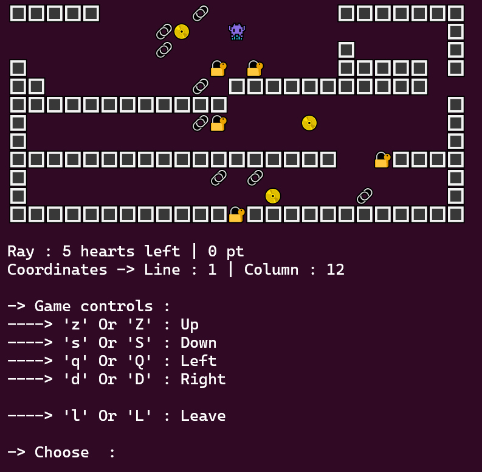

<h1 align="center">👾👾</h1>



## Table of contents

- [Description](#description)
- [Architecture](#architecture)
- [Prerequisites](#prerequisites)
- [Installation](#installation)
- [Commands](#commands)
- [Technologies](#technologies)
- [Tutorial](#tutorial)
- [License](#license)
- [Author](#author)

## Description

"****" is a Java console application where you can play many levels with different enemies and items, and even create your own. It is a project that I did in my first year of computer engineering studies.

## Architecture
```
.
├── Game.png
├── LICENSE
├── Makefile
├── README.md
├── bin
│   └── com
│       └── app
│           ├── Cell.class
│           ├── CellType.class
│           ├── Coordinates.class
│           ├── Direction.class
│           ├── Level$1.class
│           ├── Level.class
│           ├── Main.class
│           ├── Player.class
│           └── View.class
├── doc
│   ├── allclasses-index.html
│   ├── allpackages-index.html
│   ├── com
│   │   └── app
│   │       ├── Cell.html
│   │       ├── Coordinates.html
│   │       ├── Level.html
│   │       ├── Main.html
│   │       ├── Player.html
│   │       ├── View.html
│   │       ├── package-summary.html
│   │       └── package-tree.html
│   ├── copy.svg
│   ├── element-list
│   ├── help-doc.html
│   ├── index-all.html
│   ├── index.html
│   ├── legal
│   │   ├── ASSEMBLY_EXCEPTION
│   │   ├── jquery.md
│   │   └── jqueryUI.md
│   ├── link.svg
│   ├── member-search-index.js
│   ├── module-search-index.js
│   ├── overview-tree.html
│   ├── package-search-index.js
│   ├── resources
│   │   ├── glass.png
│   │   └── x.png
│   ├── script-dir
│   │   ├── jquery-3.7.1.min.js
│   │   ├── jquery-ui.min.css
│   │   └── jquery-ui.min.js
│   ├── script.js
│   ├── search-page.js
│   ├── search.html
│   ├── search.js
│   ├── stylesheet.css
│   ├── tag-search-index.js
│   └── type-search-index.js
├── game.jar
├── map.txt
├── map1.txt
└── src
    └── com
        └── app
            ├── Cell.java
            ├── Coordinates.java
            ├── Level.java
            ├── Main.java
            ├── Player.java
            └── View.java
```

- **Makefile** : To run the project and other commands easily

- **class** : Contains the compiled `.class` files

- **doc** : Contains the Javadoc documentation

- **src** : Contains the `.java` files

- **game.jar** : The `.jar` target of the project

## Prerequisites

- Java 21+

## Installation

1. **Clone the repository**
```bash
git clone https://github.com/RayyyZen/Game.git
```

2. **Go to the project folder**
```bash
cd Game/
```

3. **Run the project**
```bash
make run PARAM="fileName1.txt fileName2.txt ..."
```

### Files content

The files you give as arguments to the program represent the levels you will be playing. The files must follow some rules :

- They must be `.txt` files

- You must give, as arguments, the paths to the files you chose

- They must contain only these characters :

    - `\n` : To add a line

    - `1` : Player

    - ` ` : Empty

    - `#` : Wall

    - `.` : Coin

    - `*` : Trap

    - `D` : Locked door

- They must contain one occurrence of the character `1` that represents the initial position of the player

## Commands

- Run the project : 
```bash
make run PARAM="fileName1.txt fileName2.txt ..."
```
OR
```bash
make runJar PARAM="fileName1.txt fileName2.txt ..."
```

- Create a `.jar` target :
```bash
make jar
```

- Generate the Javadoc documentation :
```bash
make doc
```

## Technologies

- **Language** : Java 21
- **Build** : Makefile
- **Interface** : Console

## Tutorial

Your goal is to go through all the levels and survive until you finish them. You start with **5 hearts** and you must avoid the enemies and the traps while taking all the coins to finish each level. The game ends if you collect all the coins on all the levels, if you lose all your hearts, or if you leave the game. The map is circular, so if you go outside the map at the top, you will find yourself at the bottom.

### Objects

- `1` or 👾 : Represents you, you can move through the levels
- `S` or 🌀 : Represents the spawn (your initial position on the level), if you loose a heart you come back there
- `#` or 🔳 : Represents walls, you can't pass through them
- `D` or 🔐 : Represents locked doors, you can't pass through them
- `.` or 📀 : Represents coins, you need to take them all to finish a level
- `*` or 🔗 : Represents traps, if you step on any of them you lose **2 hearts**

### Controls

- `d` or `D` : Right
- `q` or `Q` : Left
- `z` or `Z` : Up
- `s` or `S` : Down
- `l` or `L` : Leave the game

## License

This project is licensed under the BSD 2-Clause License. See the [LICENSE](LICENSE) file for details.

## Author

- Rayane M.